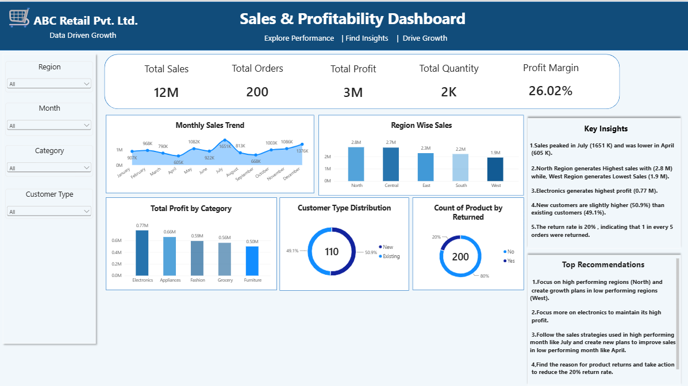

# Sales & Profitability Analysis – Power BI

## Project Overview
This project analyzes retail sales data using Power BI to understand sales performance, profitability, customer behavior, regional performance, and product returns.

The dashboard is designed to convert raw sales data into meaningful business insights and support data-driven decision-making.

## Dashboard Preview

## Key KPIs
- Total Sales: 12M
- Total Orders: 200
- Total Profit: 3M
- Total Quantity: 2K
- Profit Margin: 26.02%

## Key Insights
- Sales peaked in July at 1.65M, while April recorded the lowest sales at 605K.
- North generated the highest regional sales at 2.8M, while West recorded the lowest at 1.9M.
- Electronics generated the highest profit at 0.77M.
- New customers represent 50.9%, slightly higher than existing customers at 49.1%.
- The return rate is 20%, meaning 1 in every 5 orders was returned.

## Business Recommendations
- Focus on the North region to maintain its strong sales performance and develop growth strategies for the West region.
- Prioritize Electronics while monitoring its profitability and product returns.
- Analyze the factors behind July's strong sales performance and apply relevant strategies to lower-performing months.
- Identify products or categories with high return rates and investigate the reasons behind returns.
- Improve customer retention strategies to encourage repeat purchases from existing customers.

## Tools Used
- Power BI
- Power Query
- DAX
- Data Cleaning
- Data Visualization
- Business Analysis

## Note
ABC Retail Pvt. Ltd. is a fictional company name used for this data analysis project.
